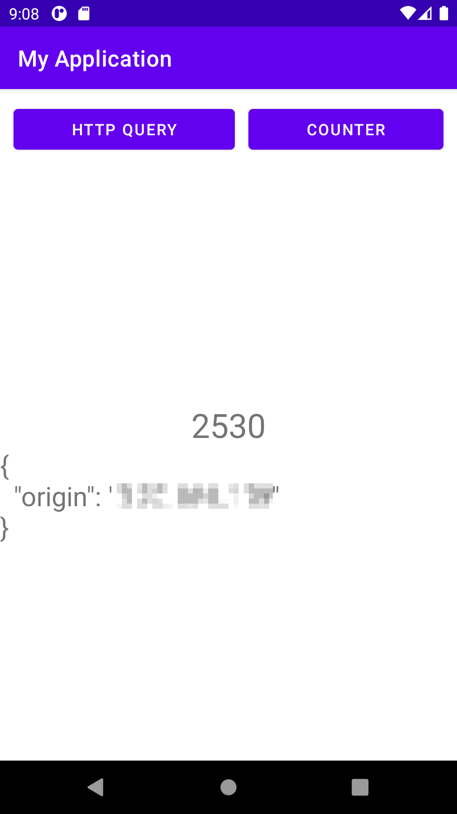

# Android + Kotlin + Fuel + Async + Coroutines
My attempt to understand what the hell this is and how it can be used to create an Android application according to 2021 basic standards.

Example Android Studio project does nothing but creates two Coroutines to different Dispatch handlers. 

That is, constantly update the main UI screen with a new number, whilst also allowing HTTP query on the other. 

# Useful reading
* https://github.com/mitchtabian/Kotlin-Coroutine-Examples/blob/master/app/src/main/java/com/codingwithmitch/coroutineexamples/MainActivity.kt
* https://medium.com/better-programming/asynchronous-programming-with-kotlin-coroutines-5b3417f53ac6
* https://www.youtube.com/watch?v=t-3TOke8tq8 
* https://www.youtube.com/watch?v=2QInrEaXyMo
* https://www.youtube.com/watch?v=C38lG2wraoo

